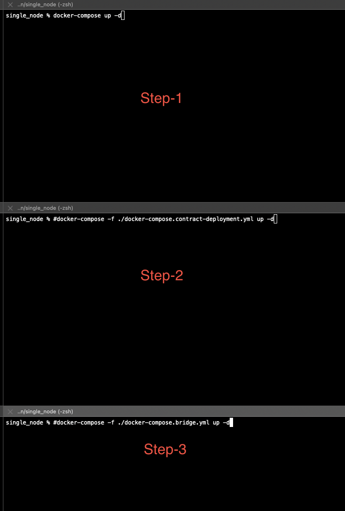

## Docs

## Run Nodes

- Start:

```
docker-compose build
docker-compose up -d
```

- Stop:

```
docker-compose down
```

There is problem with evmos nodes, so some time because of unexpected errors, its websockets connection is lost.
This can be resolved by restarting the node with `docker-compose restart layer-1 layer-2 layer-3` command.

### Metamask Configuration:
- Network Name: `Evmos Local`
- RPC URL: `http://localhost:8545`
- Chain ID: `9000`
- Symbol: `tEVMOS`
- Block Explorer URL: `http://localhost`

### Deploy Bridge contracts
```
 docker-compose -f ./docker-compose.contract-deployment.yml build
 docker-compose -f ./docker-compose.contract-deployment.yml up -d
```
This will deploy the contracts in all 3 layers with same contract addresses everytime.

### Deploy bridges
```
 docker-com -f ./docker-compose.contract-deployment.yml build
 docker-compose -f ./docker-compose.contract-deployment.yml up -d
```
In the bridge container we are running one event listener for each layer.
It will listen to events from the layer contract and send them to the other layer contract.
And there are event consumers for each layer contract.
It will consume the events from the layer contract and send them to the other layer contract.



### Note
You have to run this setup after running the hyperledger fabric network.

### Trouleshooting
You might miss blocks so you can again broadcast the new transactions to the blockchain. Because of timeout we may miss the blocks.pwd